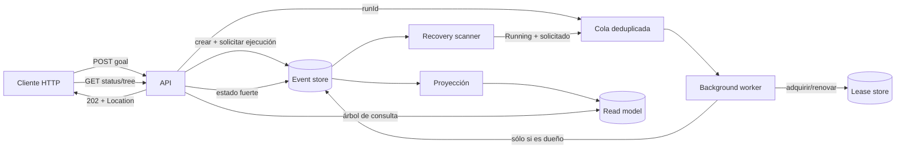

# Paso 13 · API asíncrona: aceptar, observar y reanudar

## Objetivo

Exponer el workflow recursivo como una operación larga sin mantener abierto el
request HTTP. La regla central es:

> La API confirma `202 Accepted` después de persistir el run y su raíz. Si debe
> ejecutarlo, persiste además esa intención antes de encolarlo. La ejecución
> ocurre en otro componente y siempre puede reconstruirse desde los streams.

No usamos `Task.Run` ni una tarea suelta desde el endpoint. Ese patrón pierde
seguimiento cuando el proceso cae y mezcla la vida del request con la del
workflow.

## Arquitectura



Las responsabilidades quedan separadas:

- `RecursiveWorkflowRunner`: inicia o reanuda; no conoce HTTP ni la cola.
- `WorkflowRunQueue`: entrega IDs y evita duplicados dentro de este proceso.
- `WorkflowRunWorker`: consume la cola y ejecuta fuera del request.
- `IExecutionLeaseStore`: contrato genérico de adquisición, renovación,
  liberación y lectura optimista; no conoce workflows ni agentes.
- `PostgresExecutionLeaseStore`: arbitra con el reloj de PostgreSQL y conserva
  propietario, vencimiento y token de fencing en `curso_coordination`.
- `WorkflowRunLeaseExecutor`: adapta el recurso `workflow-run:{runId}`, renueva
  mientras ejecuta y cancela el runner si pierde el lease.
- `WorkflowAcceptanceService`: resuelve idempotencia, crea el run y persiste
  `WorkflowRunExecutionRequested` antes de intentar encolarlo.
- `WorkflowRecoveryScanner`: redescubre periódicamente trabajo solicitado que
  quedó `Running` tras una caída; nunca inicia un run deliberadamente diferido.
- `WorkflowExecutionReader`: decide existencia y estado desde la fuente de verdad.
- `WorkflowReadModelStore`: devuelve la vista jerárquica, eventualmente consistente.
- `WorkflowAuditStore`: consulta eventos de run y nodos sin depender de la proyección.

## Contrato HTTP

| Operación | Resultado |
|---|---|
| `POST /api/workflow-runs` | Persiste run + raíz y, si corresponde, la solicitud de ejecución; devuelve `202`, `runId`, `Location` y links |
| `GET /api/workflow-runs/{runId}` | Estado fuerte + árbol proyectado + indicador de cola |
| `GET /api/workflow-runs/{runId}/audit` | Historia JSON ordenada por posición global |
| `POST /api/workflow-runs/{runId}/resume` | Persiste la solicitud y encola un `Running`; deduplica si ya estaba; un `Completed` es no-op |

El body de creación es:

```json
{
  "goal": "Diseñar una guía práctica para revisar un workflow híbrido",
  "startImmediately": true
}
```

`startImmediately` vale `true` por defecto. Usá `false` para estudiar la
frontera durable: la respuesta llega con el run `Running`, la raíz `Pending` y
exactamente dos eventos. Después llamá a `/resume`.

El header opcional `Idempotency-Key` identifica la aceptación. La misma clave
y el mismo `goal` devuelven el mismo `runId` y `Location`; la misma clave con
otro objetivo responde `409 Conflict`. La clave se transforma mediante SHA-256
y no se guarda en claro. `startImmediately` es una instrucción de entrega, no
parte de la identidad: puede usarse para despachar después un run creado de
forma diferida con la misma clave.

## Probalo

Primero levantá Postgres y la API:

```bash
cd 02-ejemplo
docker compose up -d
dotnet run --project src/CursoAgentes.Api --urls http://localhost:5090
```

Desde otra terminal:

```bash
curl -i -X POST http://localhost:5090/api/workflow-runs \
  -H "Content-Type: application/json" \
  -H "Idempotency-Key: ejemplo-workflow-001" \
  -d '{"goal":"Revisar un workflow híbrido","startImmediately":false}'

# Reemplazá RUN_ID con el valor recibido.
curl http://localhost:5090/api/workflow-runs/RUN_ID
curl http://localhost:5090/api/workflow-runs/RUN_ID/audit
curl -i -X POST http://localhost:5090/api/workflow-runs/RUN_ID/resume
curl http://localhost:5090/api/workflow-runs/RUN_ID
```

Con el LLM falso y `MaxDepth=3`, la verificación real dio:

1. creación diferida → HTTP `202`, run `Running`, raíz `Pending`, 2 eventos;
2. repetir el `POST` con la misma clave → mismo run y `wasCreated=false`;
3. resume → persiste una sola solicitud y devuelve `scheduled=true`;
4. reiniciar la API antes de terminar → el scanner vuelve a encolarlo;
5. final → fuente y proyección `Completed`, raíz con 2 hijos;
6. auditoría → 48 eventos en 16 streams (run + solicitud + 15 nodos).

## Consistencia: dos lecturas con propósitos distintos

El endpoint de estado no decide si el run existe mirando una tabla proyectada.
Lee `workflow-run-{id}` directamente, porque el read model puede tardar unos
milisegundos. Por eso puede responder `status: Running` y todavía devolver
`treeProjectionAvailable: false`. No es una contradicción: muestra de forma
explícita la consistencia eventual.

La auditoría tampoco descubre nodos desde el read model. Busca los
`WorkflowNodeCreated` cuyo `runId` coincide y luego trae todos los eventos de
esos streams. Así sigue siendo completa aunque la proyección esté atrasada.

## Qué garantizan la cola y el lease

`WorkflowRunQueue` usa una clave por `runId` mientras el trabajo está encolado
o ejecutándose. Dos llamadas cercanas a `/resume` no producen dos ejecuciones
en el mismo host. Si un trabajo falla, la clave se libera y el worker continúa
con el siguiente.

La cola no es durable, pero ya no es la fuente de verdad:

- si el proceso cae, su memoria desaparece, pero el run sigue `Running` y la
  solicitud sigue persistida;
- el scanner consulta candidatos proyectados, confirma el stream y omite los
  que ya tienen un lease activo; esa lectura sólo evita churn;
- un run creado con `startImmediately:false` no lleva solicitud y el scanner no
  lo ejecuta por accidente;
- dos instancias pueden descubrir y encolar el mismo run, pero la adquisición
  atómica del worker entrega el lease a una sola;
- el dueño renueva antes del vencimiento; si la renovación falla o el token ya
  no coincide, cancela cooperativamente el runner y el lease vence solo;
- la ventana “el LLM respondió pero el evento no se escribió” todavía puede
  repetir esa llamada. Event sourcing evita repetir trabajo persistido, no
  vuelve exactamente-once a un I/O externo.

El lease es estado operacional temporal, no un hecho de negocio, por eso vive
en una tabla de coordinación y no en el stream. PostgreSQL usa
`clock_timestamp()` para evitar desacuerdos entre relojes de hosts. Cada cambio
de propietario aumenta `lease_token`; renovar y liberar exige que coincidan
recurso, dueño y token. La lectura previa del scanner puede quedar vieja: sólo
`TryAcquireAsync` decide quién ejecuta.

## Una trampa del host web en Windows

`WebApplication` registra Windows Event Log por defecto. En un usuario sin
privilegios, un log interno de Eventuous puede fallar al escribir allí; esa
excepción del logger termina abortando el consumo y deja quieto el checkpoint.
La API limpia los providers y registra consola explícitamente, igual que la app
de demostración. El logging de una reacción durable tampoco debe ser un efecto
privilegiado capaz de romperla.

## Tests sin PostgreSQL

`WorkflowApiHostTests` cubre doce comportamientos aislados:

- deduplicar mientras un run está pendiente;
- liberar la clave al terminar;
- ejecutar desde el worker;
- continuar con el siguiente run después de un fallo;
- reconstruir jerarquía y orden del árbol (incluido read model todavía vacío);
- devolver el mismo run ante el replay de una `Idempotency-Key`;
- rechazar clave igual con `goal` distinto;
- persistir la solicitud antes de programar trabajo inmediato;
- recuperar mediante el scanner un run solicitado que sigue `Running`;
- permitir que sólo uno de dos ejecutores con store compartido avance;
- permitir takeover de un lease vencido con token de fencing mayor;
- cancelar la ejecución local cuando se pierde una renovación.

La persistencia y el resume ya están cubiertos por los tests del runner con el
event store en memoria. El ciclo HTTP completo se verificó además contra
PostgreSQL real. En la prueba de caída se aceptó un árbol de profundidad 10, se
terminó el proceso justo después del `202` y se reinició la API. El scanner
recuperó automáticamente el run: terminó con 2047 nodos, 6144 eventos y
exactamente un `WorkflowRunExecutionRequested`.

La prueba multi-instancia levantó dos APIs contra el mismo PostgreSQL. Sólo una
adquirió y renovó el lease; la otra observó que seguía activo. El run terminó
con 127 nodos, 384 eventos exactos y 128 streams, y la fila quedó liberada. No
hubo una segunda ejecución ni transiciones duplicadas.

## Límites deliberados y siguiente endurecimiento

Este host es un ejemplo pedagógico útil, no un scheduler distribuido completo.
Los siguientes pasos naturales son:

1. propagar el fencing token hasta cada escritura para rechazar a un proceso
   pausado que despierte después de que otro dueño tomó el lease;
2. checkpoint de intentos/resultados LLM para cerrar la última ventana de repetición;
3. autenticación, límites de tamaño y observabilidad operativa.

Esas extensiones pertenecen al host o a abstracciones de ejecución generales;
no introducen conceptos específicos de AngelNaira en MiyuAgents ni en el motor.

---

**Volver**: [Índice de la guía](00-indice.md).
